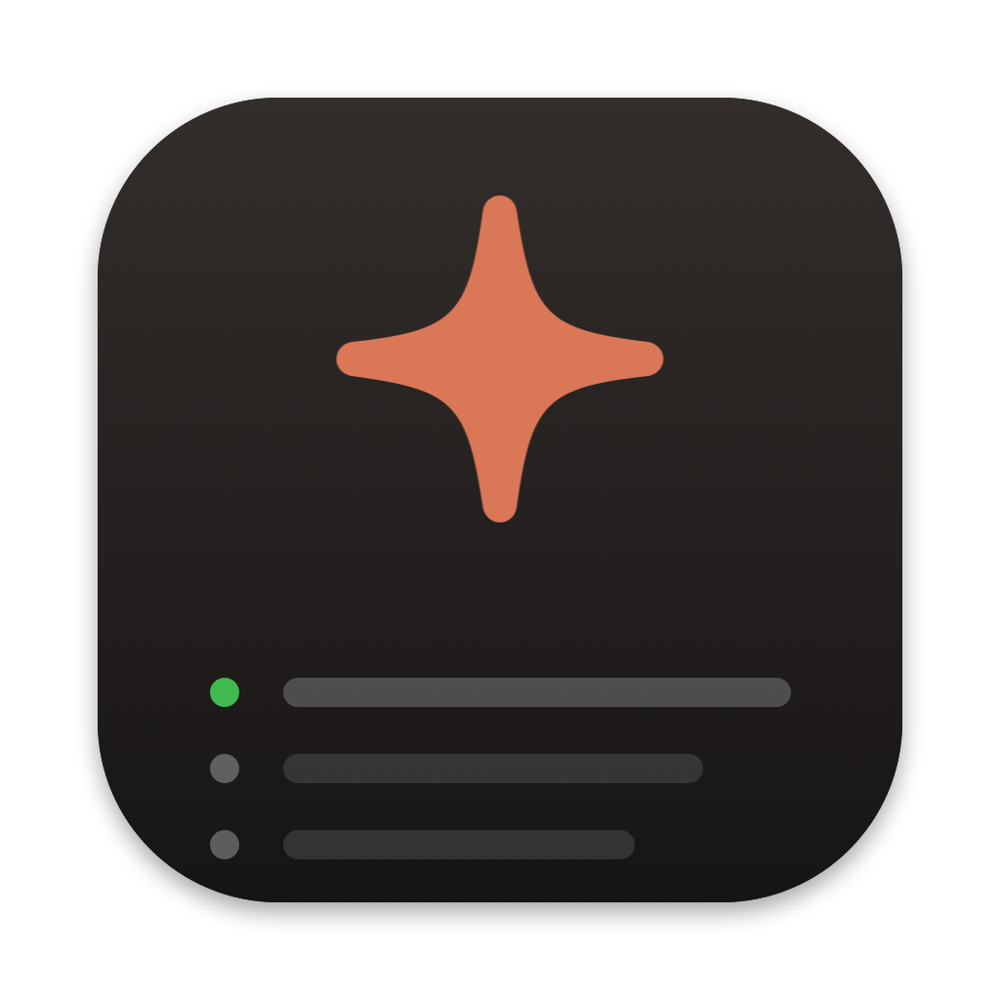
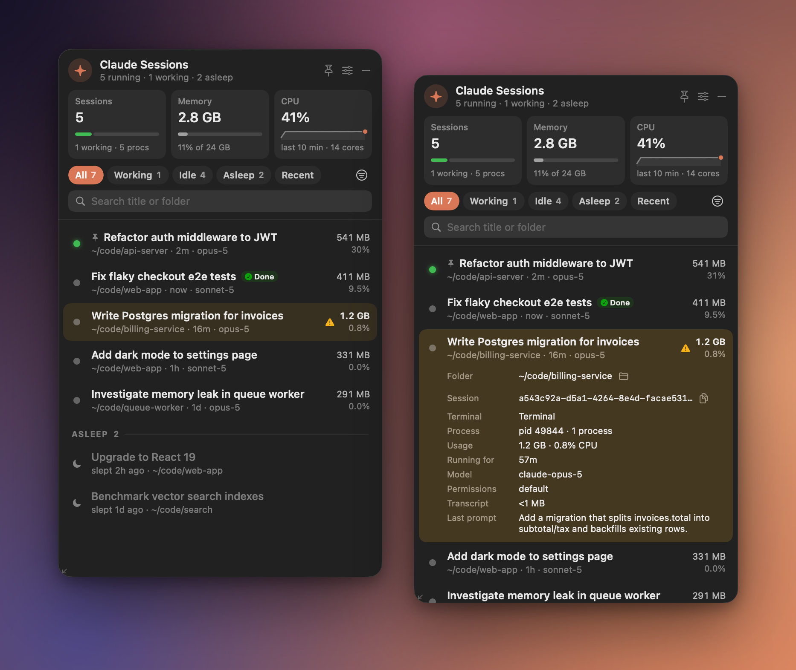
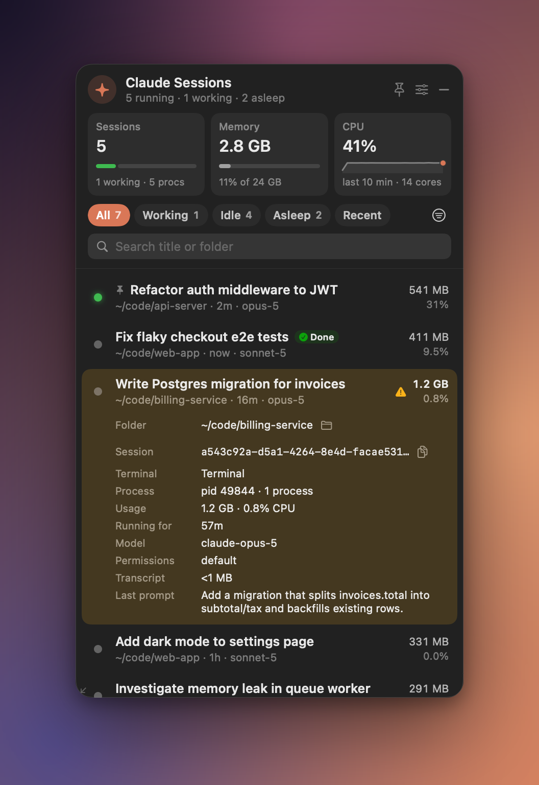
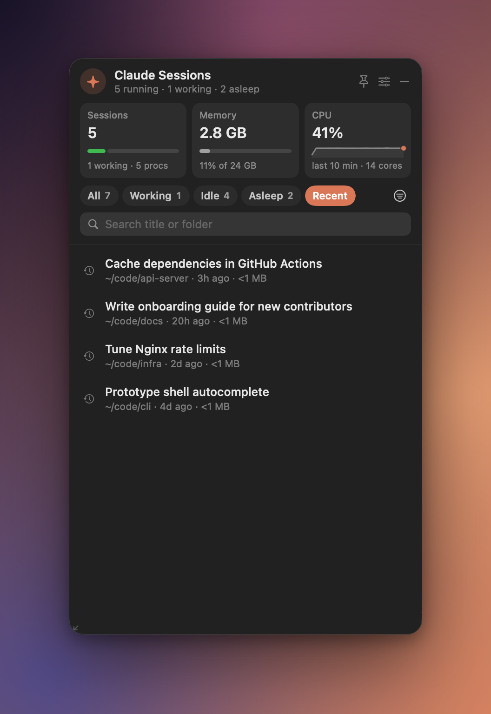
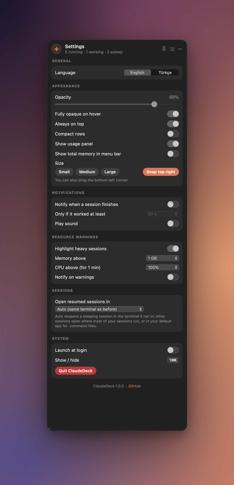

<p align="right">🇬🇧 <a href="README.md">English</a></p>

<p align="center">
  
</p>

<h1 align="center">ClaudeDeck</h1>

<p align="center">
  <b>Mac'indeki tüm Claude Code oturumları — tek bir yüzen kartta.</b><br>
  Oturum başına bellek ve CPU'yu gör, boştakileri uyut, sonra tam kaldıkları yerden devam ettir.
</p>

<p align="center">
  <a href="https://github.com/yentur/ClaudeDeck/releases/latest"></a>
  
  
  <a href="LICENSE"></a>
  <a href="#kurulum"></a>
  <a href="https://github.com/yentur/ClaudeDeck/actions/workflows/ci.yml"></a>
</p>

<p align="center">
  
</p>

## Neden ClaudeDeck?

Aynı anda birkaç Claude Code oturumundan fazlasını çalıştırmaya başladığında terminal sekmeleri bilmen gerekenleri söylemez olur:

- **Hangisi RAM'i yiyor?** Her oturum yanında MCP sunucuları, dil sunucuları ve derleme araçları taşır. ClaudeDeck her oturumun tüm süreç ağacını toplar; ağır olan hemen göze çarpar.
- **Hangisi bitti?** Bir oturum turunu bitirip seni beklemeye başladığı anda bildirim al — tıkla, doğrudan sekmesine geç.
- **Bağlamı kaybetmeden kapatabilir miyim?** Oturumu uyutarak belleğini boşalt; sonra `claude --resume` ile aynı klasörde, aynı bayraklarla uyandır.

ClaudeDeck yolundan çekilen küçük, yerel bir uygulamadır (SwiftUI + AppKit): sağ üst köşeye sabitlenmiş, <kbd>⌥</kbd><kbd>⌘</kbd><kbd>K</kbd> ile açılıp kapanan yarı saydam bir kart. Tamamen yereldir ve hafiftir: boştayken ~%0,5–1 CPU ve ~40–60 MB bellek.

## Özellikler

**📊 Her şey bir bakışta**
- 🟢 Çalışan tüm Claude Code CLI oturumları tek listede, durum noktasıyla: çalışıyor (nabız atar), shell komutu çalıştırıyor veya boşta.
- 🏷️ Gerçek başlıklar (transcript'teki yapay zekâ başlığı ya da senin verdiğin isim), yanında klasör · son etkinlik · model.
- 🧠 Oturum başına bellek ve CPU, tüm süreç ağacı üzerinden ölçülür: `claude` + MCP sunucuları + araçlar ve alt süreçler.
- 📈 Kullanım paneli: çalışan/boşta çubuğu ve süreç sayısıyla oturum sayısı, RAM payı ölçeğiyle toplam bellek ve 10 dakikalık sparkline ile toplam CPU (üzerine gelince geçmiş değerleri okursun).
- 🔎 Her oturum için ayrıntılar: klasör, session ID, pid ve süreç sayısı, kullanım, çalışma süresi, model, izin modu, transcript boyutu ve son istem.

**😴 Uyut, uyandır, devam ettir**
- 💤 **Uyut** oturumu hemen kapatır ve tam kaldığı yerden nasıl devam ettirileceğini hatırlar — `--dangerously-skip-permissions`, `--model`, `--permission-mode` ve `--add-dir` gibi bayraklar dahil.
- ▶️ **Uyandır** oturumu terminalinde `claude --resume` ile, özgün proje klasöründe yeniden açar.
- 🧹 **Boştaki oturumları uyut**: 1 sa / 6 sa / 24 sa / 3 günden uzun boşta kalanları tek seferde uyutur; menü ne kadar bellek boşalacağını gösterir.
- 🕘 **Geçmiş** sekmesi: bitmiş oturumlar (ClaudeDeck'in hiç dokunmadıkları dahil), tek tıkla devam ettirilebilir. İzin modu geri yüklenir ve oturum özgün proje klasöründe çalışır.

**🔔 Haberin olsun**
- ✅ Tur bitti uyarıları: çalışan bir oturum en az N saniye çalıştıktan sonra boşa düşünce macOS bildirimi (tıklayınca oturuma geçer), satırda **Bitti** rozeti ve menü çubuğunda ✓ sayısı. Bildirim izni yoksa ClaudeDeck bunun yerine ses çalar.
- ⚠️ Kaynak uyarıları: bir oturum ağacı bellek limitini (varsayılan 2 GB) aşınca ya da CPU limitinin (varsayılan 1 dakika boyunca %100) üstünde kalınca satır sarıya döner. İsteğe bağlı bildirim.

**🖥️ İş akışına uyar**
- 🎯 Bir satıra tıklayarak terminal sekmesine geç — cmux, Terminal.app, iTerm2, Ghostty, kitty, WezTerm ve tmux panelleri (bkz. [Desteklenen terminaller](#desteklenen-terminaller)).
- 📌 Sabitleme, filtreler (Tümü · Çalışan · Boşta · Uyuyan · Geçmiş), başlık, klasör ve son istemde arama; duruma, belleğe, CPU'ya, son etkinliğe veya ada göre sıralama.
- 🎛️ Ayarlar: English / Türkçe, saydamlık, üzerine gelince tam opak, her zaman üstte, kompakt satırlar, kullanım paneli, menü çubuğunda toplam bellek, boyut hazır ayarları, bildirimler, uyarı limitleri, devam ettirilen oturumların açılacağı terminal ve girişte başlatma.
- 🔒 Tasarımdan gizlilik: ağ erişimi yok, telemetri yok; `~/.claude` yalnızca okunur.

## Ekran görüntüleri

<table>
  <tr>
    <td align="center"><br><sub>Oturum ayrıntıları</sub></td>
    <td align="center"><br><sub>Geçmiş oturumlar</sub></td>
    <td align="center"><br><sub>Ayarlar</sub></td>
  </tr>
</table>

## Kurulum

Apple Silicon veya Intel üzerinde **macOS 14 Sonoma veya üstü** ve kurulu Claude Code gerekir.

### Homebrew

```bash
brew install --cask yentur/tap/claudedeck
```

<a id="indir"></a>

### İndir

1. [Son sürümden](https://github.com/yentur/ClaudeDeck/releases/latest) `ClaudeDeck-<sürüm>.zip` dosyasını indir.
2. Zip'i aç ve **ClaudeDeck.app**'i **Uygulamalar** klasörüne taşı.
3. Uygulamayı aç. Kart sağ üst köşede belirir; göstermek veya gizlemek için <kbd>⌥</kbd><kbd>⌘</kbd><kbd>K</kbd>'ye bas.

<details>
<summary><b>“ClaudeDeck açılamıyor” / Gatekeeper uyarısı</b></summary>

<br>

ClaudeDeck ad-hoc imzalıdır ancak Apple tarafından noter onaylı (notarized) değildir; bu yüzden macOS ilk açılışı onaylamanı ister. Bunu her indirme için yalnızca bir kez yapman gerekir.

**macOS 15 Sequoia ve sonrası**

1. ClaudeDeck'i aç. Uyarı çıkınca **Bitti**'ye tıkla.
2. **Sistem Ayarları → Gizlilik ve Güvenlik**'i aç ve **Güvenlik** bölümüne kadar aşağı kaydır.
3. “ClaudeDeck, Mac'inizi korumak için engellendi” satırının yanındaki **Yine de Aç**'a tıkla ve kimliğini doğrula.
4. Onay penceresinde **Yine de Aç**'a tıkla.

**macOS 14 Sonoma**

Finder'da **ClaudeDeck.app**'e Control tuşuna basarak tıkla, **Aç**'ı seç, ardından tekrar **Aç**'a tıkla.

**Terminal (her sürüm)**

```bash
xattr -dr com.apple.quarantine /Applications/ClaudeDeck.app
```

Sürüm zip'leri bir `.sha256` dosyasıyla gelir ve [sürüm iş akışı](.github/workflows/release.yml) onları etiketlenmiş kaynak koddan GitHub Actions üzerinde derler — ya da kendin derle (aşağıda).

</details>

### Kaynaktan derle

Yalnızca Xcode **Command Line Tools** gerekir (`xcode-select --install`) — Xcode gerekmez.

```bash
git clone https://github.com/yentur/ClaudeDeck.git
cd ClaudeDeck
./scripts/build-app.sh --install   # derler, ~/Applications'a kurar ve açar
```

## Kullanım

| Ne | Nasıl |
|---|---|
| Kartı göster / gizle | <kbd>⌥</kbd><kbd>⌘</kbd><kbd>K</kbd> veya menü çubuğundaki ✳︎ ikonuna tıkla (menü için sağ tık) |
| Taşı / boyutlandır | Başlıktan sürükle · sol alt köşeden sürükle · 📌 sağ üste geri yapıştırır · Ayarlar → Küçük / Orta / Büyük |
| Oturuma geç | Satırına tıkla |
| Satır işlemleri | Satırın üzerine gel: 📌 sabitle · ⌄ ayrıntılar · ⏾ uyut · ✕ kapat. Daha fazlası için sağ tık: resume komutunu kopyala, session ID kopyala, klasörü Finder'da göster |
| Uyuyan oturumu uyandır | ▶ veya satıra çift tıkla |
| Filtrele ve ara | **Tümü · Çalışan · Boşta · Uyuyan · Geçmiş**; arama başlık, klasör ve son istemde eşleşir |
| Sırala | Filtrelerin yanındaki menü → Durum / Bellek / CPU / Son etkinlik / Ad (sabitlenen oturumlar üstte kalır) |
| Toplu uyutma | Aynı menü → **Boştaki oturumları uyut**: 1 sa / 6 sa / 24 sa / 3 günden uzun boşta olanlar, boşalacak bellekle birlikte; onaylayınca hepsi uyutulur |
| Bitmiş oturumu devam ettir | **Geçmiş** sekmesi → ▶ veya çift tık |
| Tur bitti uyarıları | Ayarlar → Bildirimler: aç/kapat, en az çalışma süresi, ses. Bildirime tıklayınca oturuma geçer |
| Kaynak uyarıları | Ayarlar → Kaynak uyarıları: bellek limiti, sürekli CPU limiti, isteğe bağlı bildirimler |
| Menü çubuğu | Çalışan oturum sayısını, ✓N bitmiş oturumu ve (isteğe bağlı) toplam belleği gösterir |

## Desteklenen terminaller

**Devam ettir**, uyandırılan ve geçmiş oturumları Ayarlar'da seçtiğin terminalde açar. **Geç**, bir oturum satırına tıkladığında olan şeydir.

| Terminal | Devam ettir | Geç |
|---|:---:|---|
| cmux | ✅ | ✅ tam workspace |
| Terminal.app ¹ | ✅ | ✅ tam sekme |
| iTerm2 ¹ ² | ✅ | ✅ tam oturum, tty ile eşleşir |
| Ghostty ¹ | ✅ | ✅ çalışma dizinine göre eşleşen sekme (Ghostty 1.3+) |
| kitty ³ | ✅ | ✅ tam pencere |
| WezTerm | ✅ | ✅ tam panel |
| Warp | ✅ | ⚠️ uygulamayı öne getirir |
| Alacritty | ✅ | ⚠️ uygulamayı öne getirir |
| tmux (herhangi bir terminalin içinde) | — | ✅ istemciyi oturumun paneline geçirir |
| VS Code / Cursor terminali | — | ⚠️ uygulamayı öne getirir |

¹ Terminal.app, iTerm2 ve Ghostty'de sekmeye geçmek ile iTerm2 ve Ghostty'de devam ettirmek AppleScript kullanır; bu yüzden macOS bir kez **Otomasyon** izni ister. Terminal.app'te devam ettirmek izin gerektirmez.<br>
² iTerm2 desteği topluluk tarafından test edilmiştir, geliştirici tarafından doğrulanmamıştır.<br>
³ kitty için uzaktan kontrol gerekir: `kitty.conf`'a `allow_remote_control yes` ve `listen_on unix:/tmp/kitty` ekle, sonra kitty'yi yeniden başlat.

## Nasıl çalışır

ClaudeDeck yalnızca Claude Code'un zaten yazdıklarını ve süreç tablosunu okur. Ayrıntılı anlatım [docs/ARCHITECTURE.md](docs/ARCHITECTURE.md) dosyasında.

- **Oturumlar** Claude Code'un canlı oturum kaydından, `~/.claude/sessions/<pid>.json` dosyalarından gelir. Her kayıt süreç tablosuyla doğrulanır (pid yaşıyor, gerçekten `claude`, başlangıç zamanı aynı); böylece bayat dosyalar ve yeniden kullanılmış pid'ler elenir.
- **Başlıklar ve ayrıntılar** `~/.claude/projects/<proje>/<session-id>.jsonl` transcript'inden gelir. Yalnızca son 1 MB okunur, o da yalnızca dosya değiştiğinde.
- **Bellek ve CPU** her 3 saniyede bir, her oturumun süreç ağacı üzerinden `proc_pid_rusage` ile örneklenir — Activity Monitor'ün gösterdiği bellek ayak iziyle aynıdır. %100 CPU = bir tam çekirdek.
- **Uyut** önce `claude --resume`'un ihtiyaç duyduklarını kaydeder (session ID, klasör, başlık, bayraklar), sonra süreç ağacına `SIGTERM` gönderir; 1,5 sn sonra hâlâ yaşıyorsa `SIGKILL` gelir.
- **Uyandır** projeye `cd` yapıp `claude --resume <id>` çalıştıran, kendini silen küçük bir `.command` betiği yazar ve onu terminaline verir.

## Gizlilik ve izinler

- **Ağ yok.** ClaudeDeck hiçbir ağ isteği yapmaz; analitik veya telemetri içermez. “Güncellemeleri Denetle…” ve “GitHub'da ClaudeDeck…” yalnızca tarayıcında bir sayfa açar.
- **Claude Code verilerine salt okunur erişim.** `~/.claude` altına hiçbir şey yazılmaz. ClaudeDeck'in kendi durumu (uyuyan oturumlar, kısa ömürlü başlatma betikleri) `~/Library/Application Support/ClaudeDeck` içinde, tercihler `UserDefaults` içinde durur.
- **Bildirimler** (isteğe bağlı) — biten turlar ve kaynak uyarıları için.
- **Otomasyon** (yalnızca Terminal.app, iTerm2 veya Ghostty kullanıyorsan) — bir oturumun sekmesine odaklanmak ve iTerm2 ya da Ghostty'de devam ettirilen oturumları açmak için.

## SSS

<details>
<summary><b>“ClaudeDeck açılamıyor” veya “ClaudeDeck hasarlı”</b></summary>

<br>

Uygulama noter onaylı olmadığı için Gatekeeper indirilen kopyanın ilk açılışını engeller. [Kurulum → Gatekeeper uyarısı](#indir) adımlarını izle ya da şunu çalıştır:

```bash
xattr -dr com.apple.quarantine /Applications/ClaudeDeck.app
```

“Hasarlı” mesajı neredeyse her zaman karantina işaretinin hâlâ durduğu anlamına gelir — yukarıdaki komut bunu düzeltir. Uygulamanın **Uygulamalar** klasöründe olduğundan da emin ol: doğrudan İndirilenler'den çalıştırırsan macOS onu geçici, salt okunur bir konumdan başlatır ve ClaudeDeck önce taşımanı ister.
</details>

<details>
<summary><b>Güncellemeden sonra Otomasyon izni yeniden soruluyor</b></summary>

<br>

macOS Otomasyon iznini kod imzasına göre hatırlar. Sürüm derlemeleri ad-hoc imzalı olduğundan her yeni sürümün kimliği değişir ve macOS yeniden sorar. Bir kez **Tamam**'a tıkla; daha önce reddettiysen ClaudeDeck'i **Sistem Ayarları → Gizlilik ve Güvenlik → Otomasyon** altında yeniden etkinleştir.
</details>

<details>
<summary><b>Intel Mac'lerde çalışıyor mu?</b></summary>

<br>

Evet. Sürüm derlemeleri universal binary'dir (Apple Silicon + Intel).
</details>

<details>
<summary><b>Claude Code verilerimi değiştiriyor mu?</b></summary>

<br>

Hayır. ClaudeDeck `~/.claude` altına asla yazmaz. Oturum kaydını ve transcript'leri okur; oturumları yalnızca sen istediğinde sonlandırır (Kapat, Uyut veya Boştaki oturumları uyut).
</details>

<details>
<summary><b>Uyuyan oturumlar nerede saklanıyor?</b></summary>

<br>

`~/Library/Application Support/ClaudeDeck/sleeping.json` dosyasında: session ID, klasör, başlık, korunan bayraklar ve uyutulma zamanı. Konuşmanın kendisi Claude Code'un kendi transcript'inde kalır; `claude --resume` de onu yükler. Herhangi bir oturumu elle de devam ettirebilirsin: sağ tık → **Resume komutunu kopyala**.
</details>

<details>
<summary><b>cmux olmadan kullanabilir miyim?</b></summary>

<br>

Evet. Her terminaldeki oturumlar listede görünür. Devam ettirilen oturumların açılacağı terminali **Ayarlar → Oturumlar** bölümünden seç; her terminalde sekmeye geçişin ne yaptığını [Desteklenen terminaller](#desteklenen-terminaller) tablosunda görebilirsin.
</details>

## Katkıda bulunma

Hata bildirimleri, terminal entegrasyonları ve çeviriler memnuniyetle karşılanır. [CONTRIBUTING.md](CONTRIBUTING.md) derlemeyi, gerçek oturumlarına dokunmadan geliştirme yapmanı sağlayan sahte oturum ortamını ve kod yapısını anlatır.

## Yol haritası fikirleri

- Ayarlanabilir genel kısayol
- Daha fazla dil
- Projeye göre gruplama ve toplamlar
- Transcript'lerden oturum başına token ve maliyet kullanımı
- Noter onaylı derlemeler

Bir fikrin mi var? [Özellik isteği aç](https://github.com/yentur/ClaudeDeck/issues/new/choose).

## Lisans

[MIT](LICENSE) © 2026 Ömer Yentür

---

<sub>ClaudeDeck bağımsız bir açık kaynak projesidir; Anthropic ile bağlantılı değildir, Anthropic tarafından onaylanmamış veya desteklenmemiştir. Claude ve Claude Code, Anthropic, PBC'nin ticari markalarıdır.</sub>
